# 垂直领域大模型技术路线

「大模型不能只会开放闲聊」，人们需要的是能实实在在解决问题，提高生产力和工作效率的工具。

如我们需要一个能帮助写SQL的大模型，这个模型能跟专业的数据工程师一样，准确地给出可信赖的SQL语句，如果模型没理解人们的意图，或者不会写，也能进行拒识，而不是“强行”给出一个错误的SQL。
这就要求大模型能忠实于领域内的要求，同时克服“幻觉”，严谨准确地进行作答。当下作为通才的通用大模型很难有这样的能力。

垂直领域大模型产品化的例子：

法律大模型 法律大模型具备提供基础的法律咨询，完成简单的法律专业文书写作等功能。 <https://github.com/PKU-YuanGroup/ChatLaw> （北京大学）

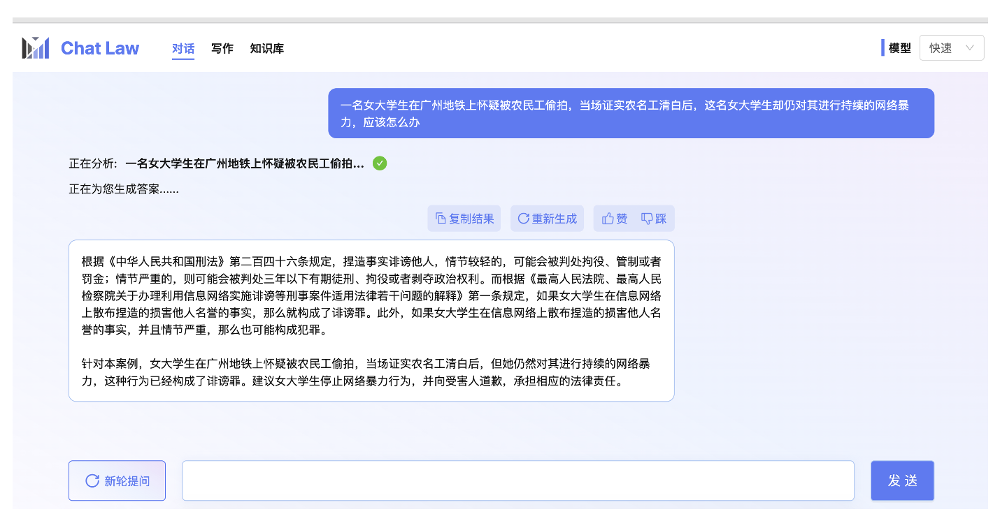

***

## 1. 垂直大模型方案

概述为 **RAG+微调大模型**

***

### 1.1. 知识召回：检索增强RAG

垂直领域大模型不会直接让模型生成答案，而是跟先检索相关的知识，然后基于召回的知识进行回答，也就是基于检索增强的生成(Retrieval Augmented Generation , RAG)。这种方式能减少模型的幻觉，保证答案的时效性，还能快速干预模型对特定问题的答案。
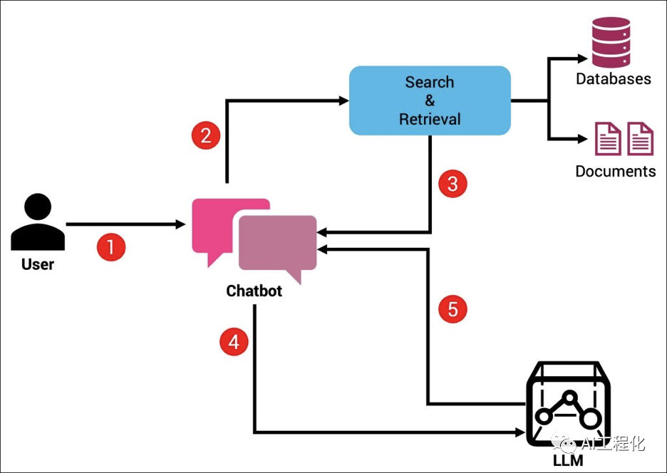

其原理如上：

1. 将基础知识构建为向量知识库
2. 将用户输入进行同样的向量化操作，再与知识库进行匹配，获得可能的相关知识
3. 将相关知识和用户输入一同传入大模型，由模型生成回答

Langchain中有许多实现的方法，如

- 文本召回（提取关键词，文本字面匹配）
- 语义召回（转化为向量匹配相似程度）

#### 1.1.1. 简介：向量搜索

向量化是将数据转换为维度。在这个的例子中，可以看到两个维度：大小和类型。
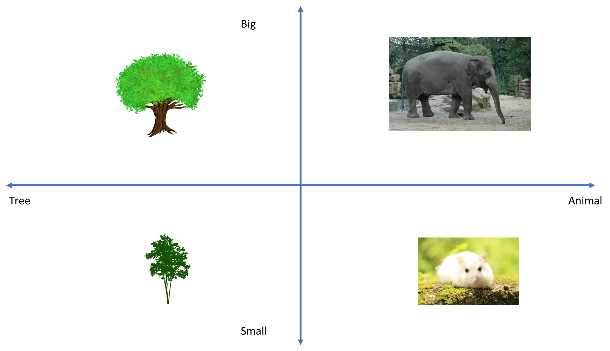

大小有两个值（小或大），类型有两个值（树或动物）。这只是一个概念性的例子，可以扩展到数百（或更多的值）。
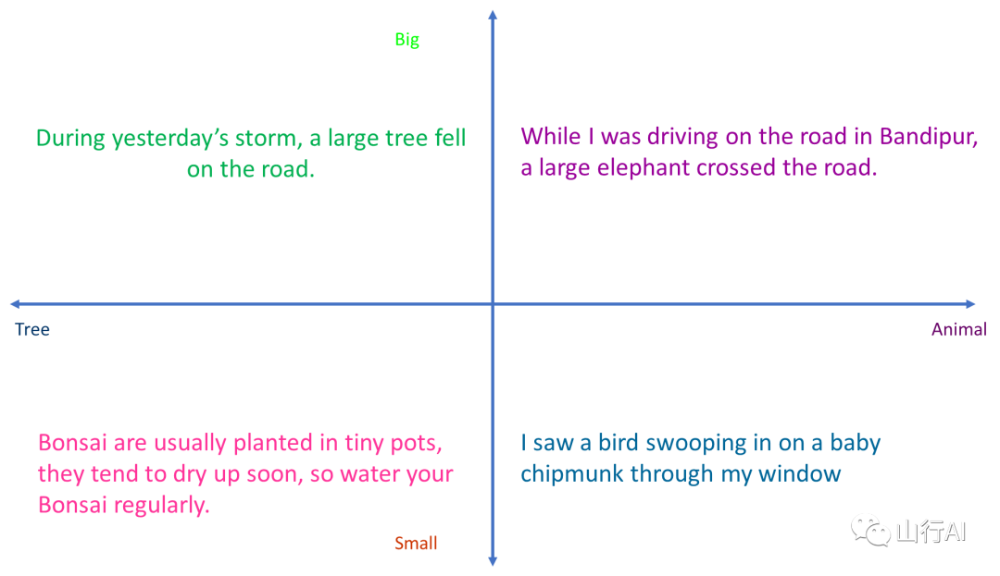

可以用单词或句子做同样的事情，而不是图片。注意在上面的例子中，向量化能够捕捉到语义表示，即它知道一个句子谈论一只鸟猛扑一只小花栗鼠应该在（小，动物）象限，而谈论昨天的风暴时一棵大树倒在路上的句子应该在（大，树）象限。

#### 1.1.2. 具体可能的方法

实际落地就会发现召回的质量往往较差，下面是一些具体的优化方案。

##### 1.1.2.1. DPR

这里根据问题召回相关的文档，本质不是一个相似句子召回问题，因为文档中的回答跟答案的相似度可能是很低的。所以这里应该建模成Dense Passage Retrieval问题，即根据问题召回能回答问题的相关文档。

如图所示，在DPR是一个双塔结构，会有两个独立的编码器分别对问题和文档进行编码。在训练的时候是一个对比学习的loss，即让不相关文档的点积近可能为0，相关文章的点积近可能为1。 科技大模型就是在科技领域的DPR监督数据上训练一个DPR模型进行知识的召回。

##### 1.1.2.2. GTR

GeneralizableT5-based dense Retrievers(GTR)是相对DPR效果更好的方法。

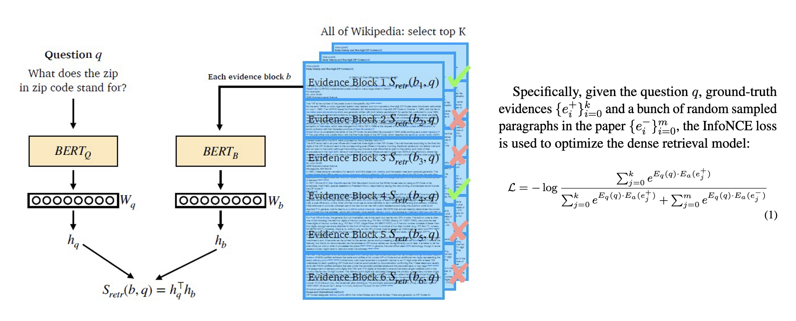

##### 1.1.2.3. Keyword LLM

在专业的垂直领域，待检索的文档往往都是非常专业的表述，而用户的问题往往是非常不专业的白话表达。所以直接拿用户的query去检索，召回的效果就会比较差。Keyword LLM就是解决这其中GAP的。

例如在ChatDoctor中(下图)，会先让大模型基于用户的query生成一系列的关键词，然后再用关键词去知识库中做检索。ChatDoctor是直接用In-Context Learning的方式进行关键词的生成。

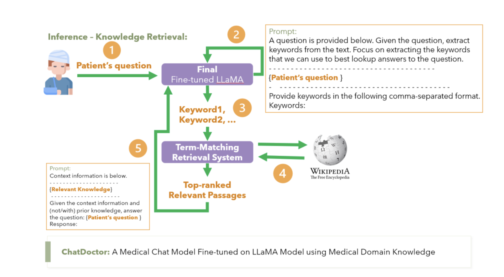
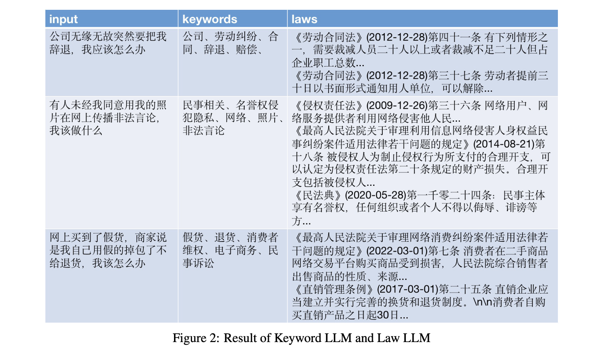

#### 1.1.3. 实战项目

[腾讯云从零构建向量数据库](https://github.com/newlxj/Crawling_VectorDB_LLM)

[向量数据库+gpt3.5](https://github.com/GanymedeNil/document.ai)

#### 1.1.4. 实际存在的问题

[对于大模型RAG技术的一些思考](https://mp.weixin.qq.com/s/IxJqDu7ljPH8ChYTC0da0A)

***

### 1.2. 微调大模型

- Continue PreTraining: 一般垂直大模型是基于通用大模型进行二次的开发。为了给模型注入领域知识，就需要用领域内的语料进行继续的预训练。
- SFT指令微调: 通过SFT可以激发大模型理解领域内各种问题并进行回答的能力(在有召回知识的基础上)
- RLHF: 通过RLHF可以让大模型的回答对齐人们的偏好，比如行文的风格。

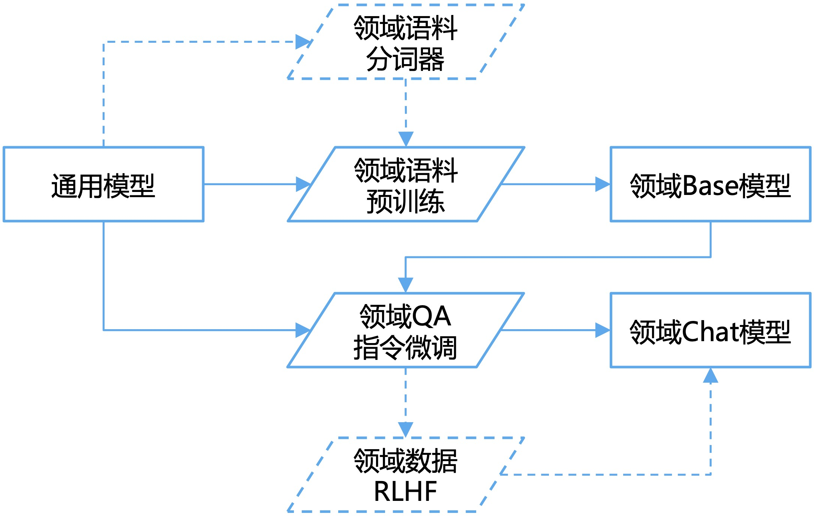

#### 1.2.1. 二次预训练

##### 1.2.1.1. 基底模型选择

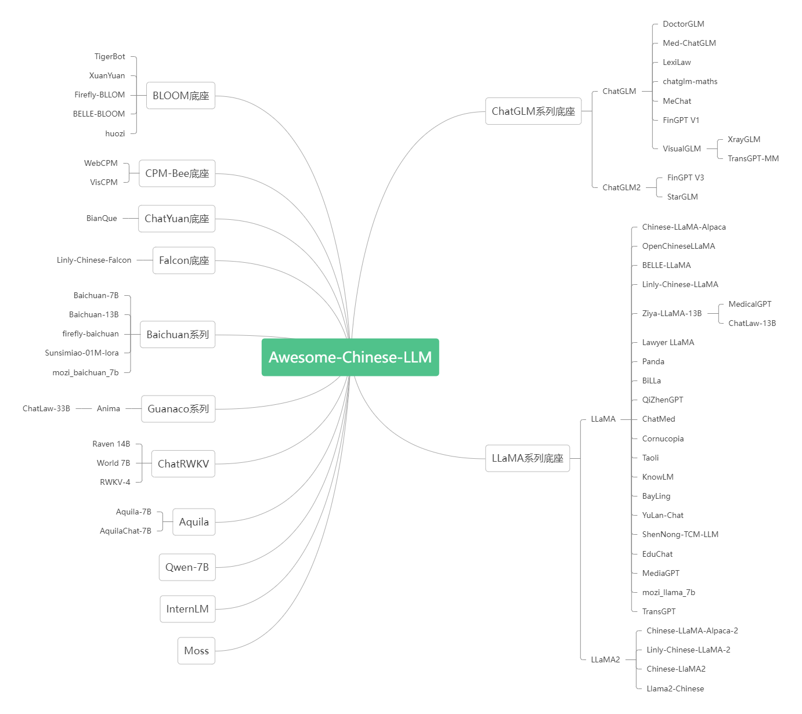

##### 1.2.1.2. 数据集构建

#### 1.2.2. 指令微调

|数据生成方法|已有数据|生成数据|
|---|---|---|
Self-Instruct|一些单轮/多轮的种子数据|单轮/多轮指令微调数据
Self-QA |文档数据 |单轮指令微调数据
Self-KG |知识图谱 |单轮指令微调数据

##### 1.2.2.1. Self-Instruct

Self-Instruct是一种微调数据扩充的方法。如果已经一些种子微调数据(理论上大约100条)，可以通过Self-Instruct+GPT4进行扩充，生成更多相对符合要求的微调数据。

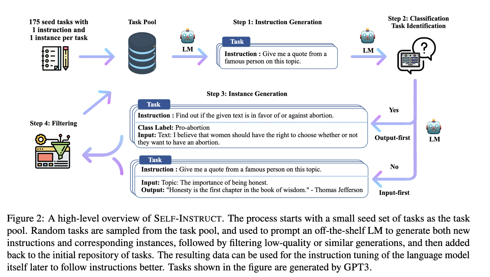

###### 1.2.2.1.1. 方法流程

1. 首先从种子指令（人工编写的指令/业务侧积累的问题）中随机选择一些指令，然后让GPT4参考这些指令，生成一系列类似的指令。

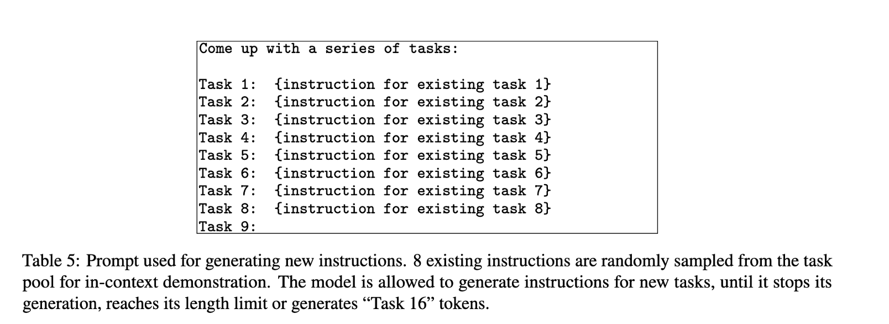
2. 有了指令后，再让GPT4判断这个指令是一个“分类”问题还是一个“生成”问题。后面会采用不同的答案生成策略。

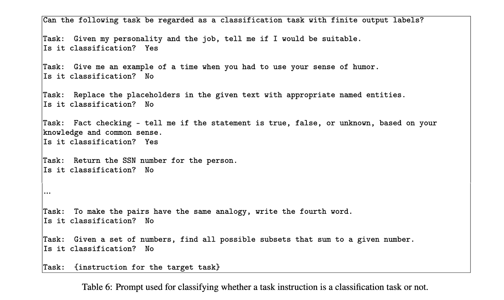
3. 如果一个问题是“分类”问题，则采用“output-first”的生成方式，即首先生成输出（具体哪个类别），然后再根据指令和输出，生成输入。 例如指令是:"判断下面句子的情感是消极还是积极"，首先生成输出的类别：“积极”，然后再根据指令和类别生成输入的句子：“我今天很开心”。

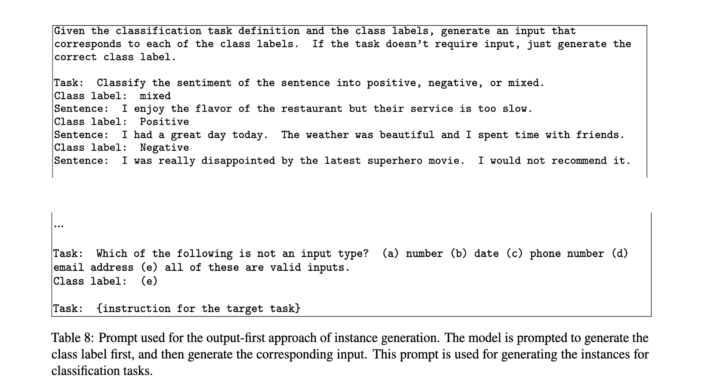

如果一个问题是“生成”问题，则采用“input-first”的生成方式，即首先生成输入，然后再根据指令和输入，生成输出。 例如指令是：“将下面的句子翻译成英文”，首先生成输入的句子：“我今天很开心”，然后再根据指令和输入生成输出的答案：“I am happy today”。如果一个指令不需要输入的句子，则输入为空。例如指令：“有哪些减肥的运动？”

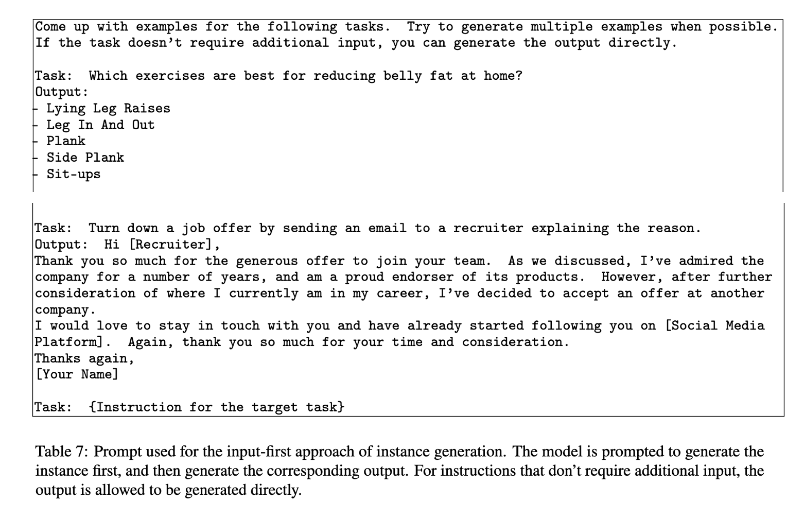
4. 经过上面的步骤就能初步获得一批微调数据，还需要进行进一步的过滤。例如过滤与已有数据相似度很高的结果，过滤明显低质的结果（指令过长或者过短）。

5.过滤后的微调数据就可以继续加入“种子指令”中，以此循环，源源不断地进行生成。

###### 1.2.2.1.2. 论文结果分析

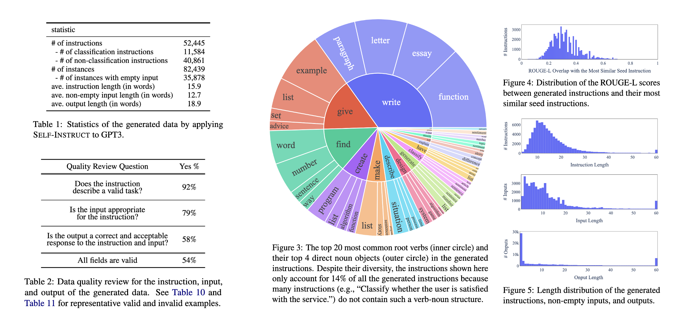

- **数量够大**：仅基于175条种子数据可以扩充8.2万条新数据
- **足够多样**：分类和生成指令的占比大概4:1；指令的动作也非常多样，包括写作，设计，创造等；指令之间的相似度也不高，长度分布也较合理
- **质量可接受**：采样标注生成的数据可以发现92%的指令都有意义，尽管输入和输出的质量不是很高，但是大部分还是格式正确或者部分正确的，这也能对训练模型遵循指令有一定的帮助。

##### 1.2.2.2. Self-QA

如果连基础的种子指令数据都没有，那就不适于Self-Instruct的方法了。这时候可以尝试Self—QA的方法，直接从文档中生成指令数据。整体的流程如下：

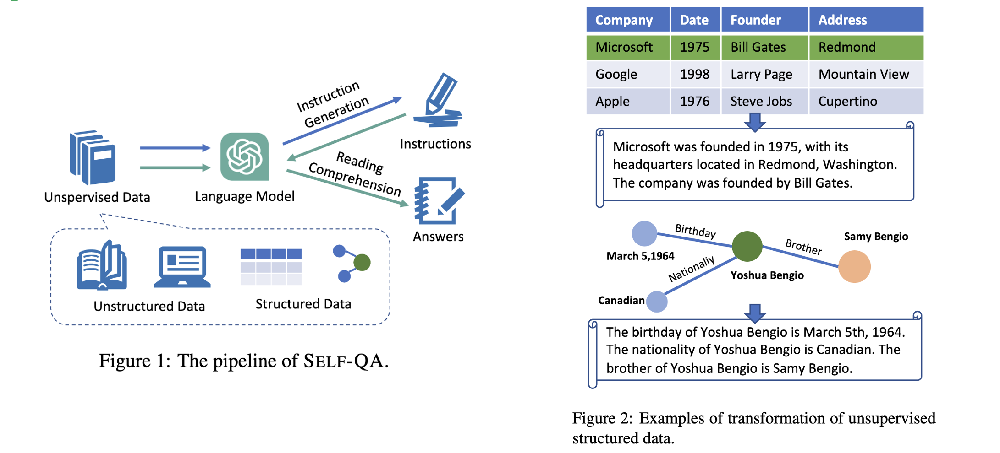

基本的思想是：首先根据无结构的文档通过GPT4生成可能的指令，然后输入指令和对应的文档再让GPT4生成问题的答案。 这里的文档可以直接就是文档语料，也可以从结构的表格数据或者图谱数据中生成无结构的文档数据。

基于设计的Prompt就可以让GPT4分别进行指令和答案的生成，由此构成指令微调数据。这些数据还需要进一步通过启发式和规则的方法进行过滤，来提高数据的质量。

##### 1.2.2.3. Self-KG

如果一个领域已经有了高质量的知识图谱，也可以直接基于知识图谱生成指令数据。这种基于知识的指令数据生成方法是HuaTuo中提出的，本文称为Self—KG。

具体而言，首先需要有一个知识图谱，如下图所示，包括节点和属性关系。
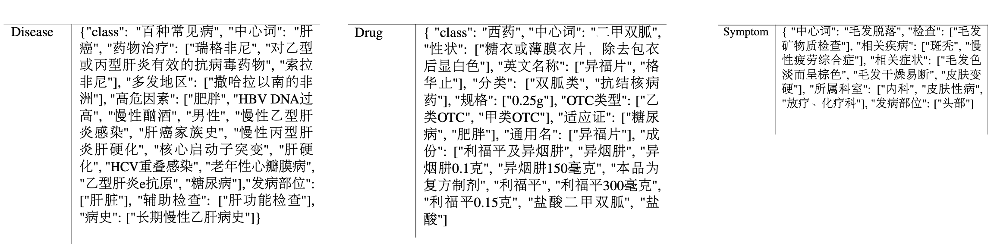

然后从知识图谱中采样一条知识，包括这个知识的全部属性，再设计prompt让GPT4基于这则知识生成指令数据。
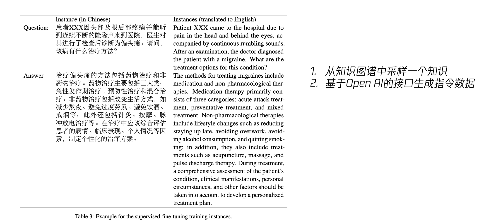

#### 1.2.3. 减缓幻觉：Generate with Citation

研究“Enabling Large Language Models to Generate Text with Citations”中显示：通过给大模型相关的知识进行参考，并且让模型在生成中附上引用的标注，能提升模型的回答质量，减少幻觉。
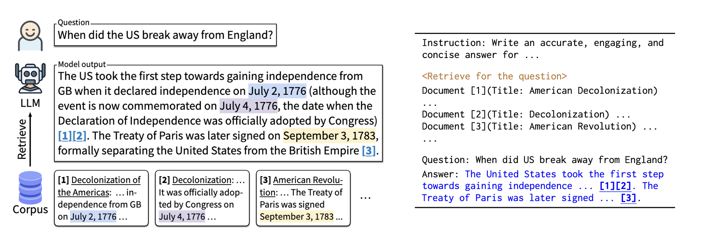

让模型输出引用还有一个好处：用户自己可以通过提供的参考快速判断回答对不对（参考不能太长）。 这样即使回答错了，用户也能自己知道，相对可控。

作者的分析表明，回答的质量与召回文档的质量有很大关系，这部分还有很大的提升空间。如何提升知识召回的质量在后文会分析。

Factual Consistency Evaluation

如前文所说，用户可以根据提供的参考快速判断回答是否正确。我们也可以直接训练一个模型来做这样的判断。如果幻觉检测模型判断生成的内容与参考相矛盾，就可以在后处理的阶段对回答进行二次处理。

这个任务叫：事实一致性评估(Factual Consistency Evaluation)，属于自然语言推理任务Natural Language Inference(NLI)的一种。具体是给定一个前提知识和一个猜想，判断这个猜想与前提知识的关系，是包含，无关，还是矛盾。

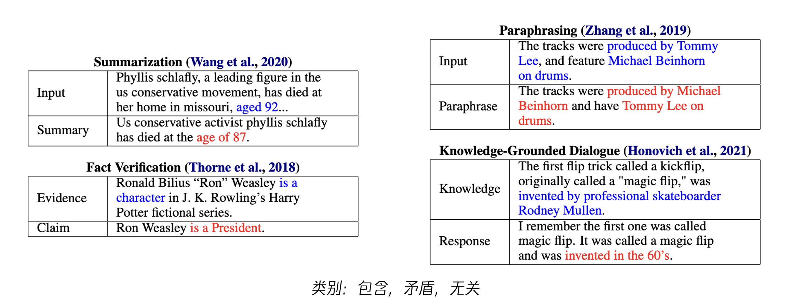

***

## 2. 数据获取（正在进行）

爬取西电官网

***

## 3. 评估

### 3.1. 通用模型

- C-Eval: 构造中文大模型的知识评估基准：
  - 地址：<https://github.com/SJTU-LIT/ceval>
  - 简介：构造了一个覆盖人文，社科，理工，其他专业四个大方向，52 个学科（微积分，线代 …），从中学到大学研究生以及职业考试，一共 13948 道题目的中文知识和推理型测试集。此外还给出了当前主流中文LLM的评测结果。

- OpenCompass:
  - 地址：<https://github.com/InternLM/opencompass>
  - 简介：由上海AI实验室发布的面向大模型评测的一站式平台。主要特点包括：开源可复现；全面的能力维度：五大维度设计，提供 50+ 个数据集约 30 万题的的模型评测方案；丰富的模型支持：已支持 20+ HuggingFace 及 API 模型；分布式高效评测：一行命令实现任务分割和分布式评测，数小时即可完成千亿模型全量评测；多样化评测范式：支持零样本、小样本及思维链评测，结合标准型或对话型提示词模板；灵活化拓展。

### 3.2. 垂直领域大模型

此问题仍然未被较好解决，目前较常用方案

- 采用考试的方式，给出题目令模型做答，以分数进行评判
- 北京大学的ChatLaw借鉴游戏的ELO匹配机制，采取模型对抗的ELO机制进行评估<https://arxiv.org/pdf/2306.16092.pdf>

***

## 4. 存在问题

1.如何拒识领域外的问题？如果不能回答，如何优雅的失败？
2.对于长文档的切分，太长的文本编码效果比较差，太短就需要能召回多个文档块，如何选择？
3.当前是基于文档的来生成答案，答案中很多内容都是从文档中直接COPY，能否对这种COPY类生成进行加速？
4.多轮对话如何召回
5.如果一句话中有多个问题要怎么召回？例如："自闭症有哪些症状？跟遗传有关吗？能被治愈吗？"
6.大模型确实容易产生幻觉，但是如果“幻觉”出来的内容是对的，就会很惊喜，我们更愿意称之为模型的“泛化”能力。如果一味减缓幻觉是不是也会让模型丧失泛化的能力？

[使用检索增强生成构建行业特定的 LLM](https://towardsdatascience.com/build-industry-specific-llms-using-retrieval-augmented-generation-af9e98bb6f68)
